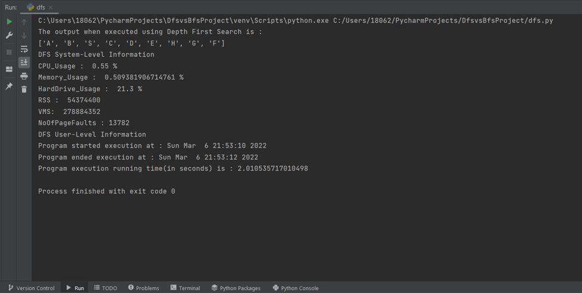
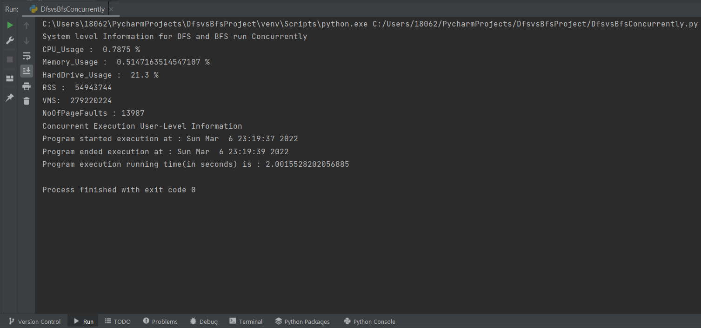

# Project: Retrieving, comparing, and presenting process profiling data
# Algorithm : DFS vs BFS
Project Description:
    The idea of this project to extracting the system vs. user-level information of the running programs and use them to compare the efficiency of two algorithms.
    
    The user-level information should include the running time (from the program starts to when it ends)
    The system-level information should include:
    1) CPU usage
    2) Memory usage
    3) Hard drive usage
    4) RSS: Resident set size: This is non-swapped physical memory that a process had used
    5) VMS: Virtual memory size: This is the total virtual memory used by the process
    6) Number of page faults

# To execute,

Download the uploaded files and unzip them 
Double-click and open the file in any of the python executable application softwares.
I have considered doing my project in "PyCharm"
The files are uploaded with the sample input within the program
Sample input taken in the execution:
	input_graph = {
    	'A': ['B', 'S'],
    	'B': ['A'],
    	'C': ['D', 'E', 'F', 'S'],
    	'D': ['C'],
    	'E': ['C', 'H'],
    	'F': ['C', 'G'],
    	'G': ['F', 'S'],
    	'H': ['E', 'G'],
   	    'S': ['A', 'C', 'G']
	}

Run the process1(dfs.py) file individually and check the output
dfs.py output :
C:\Users\18062\PycharmProjects\DfsvsBfsProject\venv\Scripts\python.exe C:/Users/18062/PycharmProjects/DfsvsBfsProject/dfs.py
The output when executed using Depth First Search is : 
['A', 'B', 'S', 'C', 'D', 'E', 'H', 'G', 'F']
DFS System-Level Information
CPU_Usage :  2.0125 %
Memory_Usage :  0.5078468147032649 %
HardDrive_Usage :  21.3 %
RSS :  54210560
VMS:  278794240
NoOfPageFaults : 13698
DFS User-Level Information
Program started execution at : Sun Mar  6 22:38:43 2022
Program ended execution at : Sun Mar  6 22:38:45 2022
Program execution running time(in seconds) is : 2.0059046745300293
Process finished with exit code 0

-The output graph image is saved with the name "DFS_Bar_Graph.png"

Run the process2(bfs.py) file individually and check the output
bfs.py output :
C:\Users\18062\PycharmProjects\DfsvsBfsProject\venv\Scripts\python.exe C:/Users/18062/PycharmProjects/DfsvsBfsProject/bfs.py
The output when executed using Breadth First Search is : 
['A', 'B', 'S', 'C', 'G', 'D', 'E', 'F', 'H']
BFS System-Level Information
CPU_Usage :  1.025 %
Memory_Usage :  0.5094202840150485 %
HardDrive_Usage :  21.3 %
RSS :  54378496
VMS:  278896640
NoOfPageFaults : 13719
BFS User-Level Information
Program started execution at : Sun Mar  6 22:40:18 2022
Program ended execution at : Sun Mar  6 22:40:20 2022
Program execution running time(in seconds) is : 2.0046701431274414
Process finished with exit code 0

-The output graph image is saved with the name "BFS_Bar_Graph.png"

Run the concurrently executable code of both the programs(DfsvsBfsConcurrently.py) and check the output
DfsvsBfsConcurrently.py output : 
C:\Users\18062\PycharmProjects\DfsvsBfsProject\venv\Scripts\python.exe C:/Users/18062/PycharmProjects/DfsvsBfsProject/DfsvsBfsConcurrently.py
System level Information for DFS and BFS run Concurrently
CPU_Usage :  1.4125 %
Memory_Usage :  0.5112240171285567 %
HardDrive_Usage :  21.3 %
RSS :  54571008
VMS:  279015424
NoOfPageFaults : 13881
Process finished with exit code 0

- The output graph image with the name "BFS_DFS_Bar_Graph.png"

